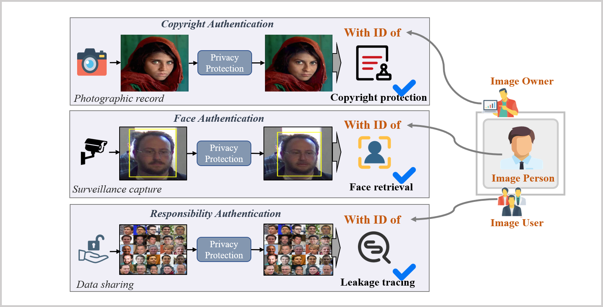

This repo is the official implementation of 
“Beyond Privacy: Generating Privacy-Preserving Faces Supporting Robust Image Authentication”  (2025 TIFS)
Tao Wang, Wenying Weng*, Xiangli Xiao, Zhongyun Hua, Yushu Zhang, Yuming Fang


Pre-trained models and insightface_func: https://drive.google.com/drive/folders/1yO-BJ6mBRHoiiKJfs05N4mwCjS7rm6qJ?usp=sharing

The face alignment processing code must be employed to resize them to 224 pixels with "data_process". We use the face detection and alignment methods from InsightFace for image preprocessing. Please download the relevant files and unzip them to ./insightface_func/models. pip install insightface==0.2.1 onnxruntime moviepy




## Acknowledgement

Part of codes are  designed based on https://github.com/neuralchen/SimSwap/tree/main

Cite
```
@ARTICLE{10884889,
  author={Wang, Tao and Wen, Wenying and Xiao, Xiangli and Hua, Zhongyun and Zhang, Yushu and Fang, Yuming},
  journal={IEEE Transactions on Information Forensics and Security}, 
  title={Beyond Privacy: Generating Privacy-Preserving Faces Supporting Robust Image Authentication}, 
  year={2025},
  volume={20},
  number={},
  pages={2564-2576},
  doi={10.1109/TIFS.2025.3541859}}


```
